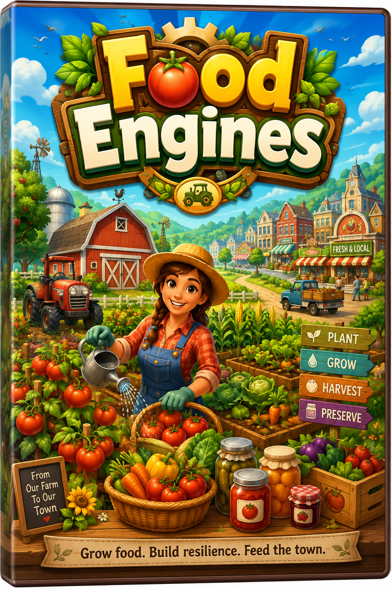

# Food Engines

**Plant the food. Feed the town. Discover that tomatoes are infrastructure.**

**Live demo:** https://bluntforceriot.github.io/food-engines/



Food Engines is a bright static browser farm-grid strategy game about food independence, built for **Summer into AI Week 2: Independence Engines**.

You get 21 days, 6 actions per day, a 10x8 farm grid, limited water, hungry town requests, changing weather, spoilage pressure, and one increasingly obvious truth: a fed town is not one crop. It is an engine.

Plant tomatoes, corn, beans, potatoes, lettuce, wheat, apples, and pumpkins. Build compost, rain barrels, wells, seed saving, kitchens, preservation, root cellars, farm stands, and market systems. Answer requests for school lunches, firehouse chili, diner pies, pantry drives, baseball stands, picnics, harvest suppers, and county fair booths.

It looks cheerful because it should. The subject is practical because independence is not a slogan. It is soil, water, seeds, labor, storage, kitchens, preservation, markets, weather response, and community trust.

The cover image is promotional documentation art, not a runtime game asset. Runtime visuals are generated with HTML/CSS and procedural shapes.

## Why It Exists

Food Engines treats food freedom as an engine, not a single crop. The player builds the connected systems that keep people fed: soil, water, seeds, labor, storage, kitchens, preservation, markets, weather response, and community trust.

## Run Locally

```sh
npm ci
npm run dev
```

Then open the local Vite URL.

## Build And Verify

```sh
npm run typecheck
npm run build
npm audit --audit-level=moderate
npm run playtest
npm run playtest:full
```

Optional review helpers:

```sh
npm run screenshots
npm run package:review
npm run verify:package
```

## How To Play

- Start a 21-day farm run.
- Each day gives 6 actions; the HUD shows `Actions Left`.
- Water is limited; the HUD shows `Water Left`.
- Select a crop and click an empty dirt plot to plant.
- Click a crop marked `WATER` to water it.
- Click a ready crop to harvest it. Harvesting costs 1 action.
- Complete Town Request Board orders for Town Fed, Food Security, Market Trust, money, and seed rewards.
- Build Food Engines to improve soil, water, seeds, kitchens, preservation, and markets.
- Use Preserve Food to convert Fresh Food into Pantry Food.
- End Day resolves growth, weather, spoilage, missed demand, and events.
- Finish Day 21 with the strongest Food Security, Town Fed, Pantry Reserves, Market Trust, Soil Health, and score you can.

## Current Systems

- 10x8 farm grid with visible crop stages.
- Eight crops: tomatoes, corn, beans, potatoes, lettuce, wheat, apples, and pumpkins.
- Weather system with rain, heat, storms, dry wind, fair weather, and perfect farm days.
- Town requests for school lunches, firehouse chili, diner pies, pantry drives, concession stands, picnics, harvest suppers, and county fair booths.
- Fifteen Food Engines across soil, water, seeds, kitchens, preservation, and markets.
- Eight engine synergies.
- Farmer's First Clipboard onboarding.
- Farm Radio / County Bulletin flavor feed.
- Local save/load and best score using browser localStorage only.
- Endgame newspaper scorecard with Copy Recap fallback.

## Privacy And Runtime

- Static browser app only.
- No backend.
- No accounts.
- No analytics.
- No telemetry.
- No remote AI/model calls.
- No external art or audio files.
- Saves are local browser storage only.

Local storage keys:

- Current run: `food-engines.currentRun.v1`
- Best score: `food-engines.bestScore.v1`

## AI Usage Note

ChatGPT/Codex were used for design expansion, implementation, review tooling, and polish. The visuals are original CSS/SVG-like procedural shapes rendered in the browser; no commercial game assets, copyrighted crop sprites, or external art packs are used.

## Known Limitations

- Balance is intentionally lightweight and arcade-board-game flavored.
- Crops use procedural CSS art rather than final illustrated sprites.
- Town requests are deterministic templates, not a large content pool.
- Save data is not migrated between future versions yet.
- Mobile layout is not the main target for this build; desktop browser play is the intended review path.

## Submission Blurb

Food Engines is a cartoon farm-grid strategy game about food independence. Players plant crops, harvest food, build water/soil/seed/kitchen/preservation/market engines, and answer town requests for school lunches, diner pies, firehouse chili, pantry drives, and county fair meals. It looks like a cheerful casual farm game, but underneath the tomatoes is a civic engine: can this little town feed itself when weather, spoilage, demand, and late grocery trucks start pushing back?
